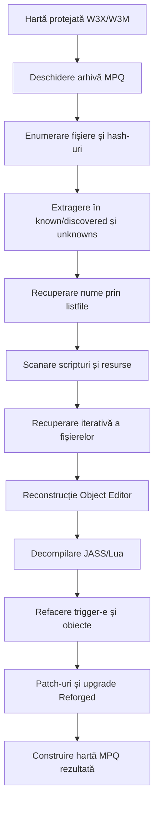

# WC3 Map Deprotector

`WC3MapDeprotector` este o aplicație Windows care încearcă să reconstruiască hărți Warcraft III protejate, astfel încât acestea să poată fi deschise și întreținute în World Editor.

Proiectul nu este un editor de hărți. Este un pipeline de recuperare care combină analiza arhivelor MPQ, detectarea formatelor de fișiere, parsarea JASS/Lua și reconstrucția formatelor interne Warcraft III.

> **Important:** deprotejarea nu este perfectă și rezultatul trebuie verificat manual în World Editor și în joc. Unele hărți pot necesita corecții manuale.

## Cuprins

- [Scopul proiectului](#scopul-proiectului)
- [Funcționalități](#funcționalități)
- [Cum funcționează pe scurt](#cum-funcționează-pe-scurt)
- [Cerințe](#cerințe)
- [Rulare](#rulare)
- [Dezvoltare și build](#dezvoltare-și-build)
- [Arhitectura proiectului](#arhitectura-proiectului)
- [Pipeline-ul tehnic](#pipeline-ul-tehnic)
- [Formatele Warcraft III](#formatele-warcraft-iii)
- [Recuperarea fișierelor necunoscute](#recuperarea-fișierelor-necunoscute)
- [Reconstrucția Object Editor-ului](#reconstrucția-object-editor-ului)
- [Decompilarea scripturilor](#decompilarea-scripturilor)
- [Conversia JASS în Lua](#conversia-jass-în-lua)
- [Structura directoarelor temporare](#structura-directoarelor-temporare)
- [Limitări cunoscute](#limitări-cunoscute)
- [Depanare](#depanare)
- [Contribuții și îmbunătățiri](#contribuții-și-îmbunătățiri)
- [Utilizare responsabilă](#utilizare-responsabilă)
- [Licență](#licență)

## Scopul proiectului

O hartă Warcraft III este o arhivă MPQ care conține scripturi, date de editor și resurse. Un protector poate elimina numele fișierelor, poate șterge fișiere necesare World Editor-ului și poate obfusca scriptul JASS.

Jocul poate rula încă o astfel de hartă folosind hash-uri interne, dar World Editor-ul are nevoie de numele reale și de fișierele în formatele așteptate. Acest proiect încearcă să refacă acea structură.

Utilizări intenționate:

- recuperarea codului sursă pierdut;
- întreținerea unei hărți abandonate;
- învățare și analiză tehnică;
- corectarea unor probleme pentru uz personal sau single-player.

## Funcționalități

- deschidere și extragere din arhive MPQ/W3X/W3M;
- identificarea fișierelor cunoscute și necunoscute;
- recuperarea numelor prin listfile și hash-uri MPQ;
- scanare a scripturilor, modelelor, texturilor și fișierelor de configurare;
- predicția extensiei reale a fișierelor fără nume;
- scanare live a accesului la fișiere în timpul rulării Warcraft III;
- reconstruirea datelor Object Editor din SLK/TXT și script;
- recuperarea unităților, item-urilor, doodad-urilor, camerelor și regiunilor;
- reconstruirea trigger-elor și a codului custom;
- conversie JASS în Lua;
- upgrade la formatele folosite de Warcraft III Reforged;
- generarea unei arhive MPQ/W3X noi;
- loguri și avertismente pentru operațiile nereușite sau incomplete.

## Cum funcționează pe scurt



Fluxul principal este implementat în `Deprotector.Deprotect()`.

## Cerințe

### Pentru rularea aplicației

- Windows;
- [.NET Desktop Runtime 8.0 – Windows x64](https://dotnet.microsoft.com/en-us/download/dotnet/thank-you/runtime-desktop-8.0.0-windows-x64-installer);
- Warcraft III instalat, dacă se dorește scanarea live;
- World Editor instalat, pentru verificarea și salvarea hărții rezultate.

### Pentru dezvoltare

- Visual Studio 2022 sau VS Code cu suport C#;
- .NET 8 SDK;
- acces la DLL-urile și binarele locale din directoarele `External\War3Net`, `External\Jass2Lua` și `External\NAudio`;
- Windows, deoarece proiectul folosește Windows Forms, StormLib și API-uri Windows.

## Rulare

Distribuția poate fi pornită cu `Launch_WC3MapDeprotector.bat`. Scriptul:

1. verifică existența .NET 8 Desktop Runtime;
2. schimbă directorul în `v1.3.0.4`;
3. pornește `WC3MapDeprotector.exe`.

Alternativ, executabilul poate fi pornit direct din directorul de release.

La prima rulare, aplicația cere căile către:

- `Warcraft III.exe`;
- `World Editor.exe`.

În interfață se selectează harta sursă și fișierul de ieșire, apoi se apasă **Rebuild Map**. Numele implicit al hărții rezultate este de forma:

```text
<directorul hărții>\deprotected\<nume>_deprotected.w3x
```

Hărțile de campanie `.w3n` nu sunt procesate direct. Misiunile trebuie mai întâi extrase ca hărți `.w3x`.

## Dezvoltare și build

Soluția `WC3MapDeprotector.sln` conține în prezent un singur proiect:

```text
WC3MapDeprotector\WC3MapDeprotector.csproj
```

Proprietăți importante ale proiectului:

- tip: `WinExe`;
- framework: `net8.0-windows`;
- Windows Forms activat;
- `AllowUnsafeBlocks=true`, necesar pentru interop cu StormLib;
- assembly version curentă: `1.3.0.4`;
- manifest Windows inclus.

Resursele necesare build-ului și rulării sunt copiate în output, printre care:

- DLL-urile locale de runtime (`FastMDX.dll`, `MdxLib.dll`, `StormLib_x64.dll` și `StormLib_x86.dll`);
- arhivele runtime din `RuntimeDependencies\`;
- `Blizzard.j` și `common.j`;
- arhivele cu date de bază Warcraft III;
- `listfile.zip`;
- șabloane Lua și fișiere RTF pentru interfață.

Build-ul se poate face din Visual Studio sau cu .NET CLI folosind soluția existentă. Nu există în repository un proiect de teste automat vizibil; verificarea principală se face prin build și testarea manuală a hărții în World Editor.

## Arhitectura proiectului

Aplicația este un monolit desktop cu separare logică pe componente:

| Fișier / componentă | Responsabilitate |
|---|---|
| `Program.cs` | Inițializează aplicația și lansează `frmMain`. |
| `frmMain.cs` | UI, selectarea fișierelor, loguri, cancel, update și conversie JASS/Lua. |
| `Deprotector.cs` | Orchestratorul întregului proces de deprotejare. |
| `StormMPQArchive.cs` | Enumeră, extrage și corelează fișierele din MPQ. |
| `StormLibrary.cs` | Declarațiile P/Invoke către StormLib. |
| `MapUtils.cs` | Operații MPQ și conversia unei hărți JASS în Lua. |
| `ObjectEditor.cs` | Parsează, combină și repară date SLK/TXT/Object Editor. |
| `ObjectManagerDecompiler_Lua.cs` | Procesează AST-ul și reconstruiește datele din script. |
| `MapUnitsDecompiler_Lua.cs` | Unități, item-uri, inventare, atribute și item drops. |
| `MapCamerasDecompiler_Lua.cs` | Camere și proprietățile lor. |
| `MapRegionsDecompiler_Lua.cs` | Regiuni, efecte meteo și sunete ambientale. |
| `FileFormatPredictor.cs` | Recunoaște formate prin semnături binare și parsere. |
| `WorldEditor.cs` | Automatizează încărcarea și salvarea în World Editor. |
| `ProcessFileAccessScanner.cs` | Monitorizează accesul jocului la fișiere prin ETW. |
| `DeprotectionResult.cs` | Numără avertismentele, protecțiile și fișierele necunoscute. |
| `DeprotectionSettings.cs` | Opțiuni pentru proces și brute-force recovery. |

## Pipeline-ul tehnic

### 1. Pregătirea mediului

`Deprotector.Deprotect()`:

- normalizează numele fișierelor;
- verifică dacă World Editor este deschis și cere închiderea lui;
- șterge directoarele temporare vechi;
- extrage arhivele cu date de bază;
- creează un `ObjectEditor` pe baza datelor Warcraft III.

### 2. Extragerea arhivei

`StormMPQArchive` deschide harta în mod read-only și enumeră fișierele cu StormLib.

Pentru fiecare intrare sunt urmărite:

- file index;
- hash index;
- cele două hash-uri parțiale;
- hash-ul complet;
- cheia de criptare;
- MD5-ul conținutului;
- fuzzy hash-ul conținutului.

Fișierele sunt separate în `discovered` și `unknowns`. Pentru cele fără nume verificabil se generează nume de forma `File00001234.ext`.

### 3. Hash-uri, duplicate și fake names

În unele MPQ-uri există intrări hash multiple sau nume artificiale. De aceea, proiectul nu folosește doar hash-ul MPQ ca identificator unic.

Conținutul extras este corelat și prin:

- MD5, pentru identificarea conținutului identic;
- fuzzy hash, pentru gruparea fișierelor aproape identice;
- extensia prezisă, pentru diferențierea numelor reale de nume false;
- file index și encryption key, pentru verificarea extragerii.

Această logică se află în `StormMPQArchive.DiscoverFile()` și metodele asociate.

### 4. Recuperarea numelor

`ProcessListFile()` calculează hash-uri parțiale pentru o listă de nume candidate și păstrează numai numele care corespund arhivei.

Sursele de nume candidate sunt:

- `(listfile)` din hartă;
- listfile-ul global din `%APPDATA%\WC3MapDeprotector`;
- listfile-ul inclus în distribuție;
- referințe din Object Editor;
- string-uri din fișiere binare și text;
- referințe interne din modele MDX/MDL;
- nume accesate de Warcraft III în timpul rulării.

### 5. Scanarea iterativă

După fiecare grup de fișiere descoperite, conținutul este rescannat. Procesul continuă până când nu mai apar:

- nume noi;
- MD5-uri noi;
- directoare noi;
- fișiere descoperite noi.

Acest mecanism este necesar deoarece o textură poate fi referită de un model, iar modelul poate fi referit de Object Editor sau de script.

### 6. Patch-uri și reconstrucție

În etapa finală aplicația:

- repară anumite valori din `war3map.w3i`;
- elimină fișierele de semnătură și atribute ale protecției;
- reconstruiește `war3map.imp`;
- reface fișierele native lipsă din harta blank;
- activează JassHelper în `war3mapExtra.txt`;
- face upgrade la formatele Reforged;
- adaugă watermark-uri și marcaje de identificare;
- construiește arhiva MPQ finală.

## Formatele Warcraft III

Fișiere întâlnite frecvent în hartă:

| Fișier | Conținut |
|---|---|
| `war3map.w3i` | Numele, descrierea, versiunea și setările hărții. |
| `war3map.j` | Script JASS compilabil. |
| `war3map.lua` | Script Lua pentru hărțile Reforged. |
| `war3map.wtg` | Trigger-e grafice. |
| `war3map.wct` | Trigger-e text și custom script. |
| `war3mapUnits.doo` | Unități și obiecte plasate pe hartă. |
| `war3map.w3u` | Modificări de unități. |
| `war3map.w3a` | Modificări de abilități. |
| `war3map.w3d` | Modificări de destructible-uri. |
| `war3map.w3t` | Modificări de item-uri. |
| `war3map.w3b` | Modificări de destructible/doodad, în funcție de versiune. |
| `war3map.w3c` | Camere. |
| `war3map.w3r` | Regiuni. |
| `war3map.imp` | Lista resurselor importate. |
| `war3mapSkin.txt` | Setări de afișare folosite de editor. |
| `war3mapExtra.txt` | Opțiuni suplimentare, inclusiv JassHelper. |

## Recuperarea fișierelor necunoscute

Un fișier „unknown” nu înseamnă neapărat că este corupt sau lipsă. Înseamnă că numele original nu a putut fi determinat.

`FileFormatPredictor` încearcă să identifice tipul fișierului folosind:

- magic bytes și semnături binare;
- parsare de imagini cu ImageSharp;
- parsare audio cu NAudio;
- identificare fonturi;
- regex pentru JASS, Lua, FDF, INI și SLK;
- parsare MDX/MDL cu FastMDX și MdxLib;
- semnături Warcraft III precum `W3E!`, `W3do`, `WTG!` și `MP3W`.

Dacă numele nu este recuperat, fișierul rămâne în `unknowns` sub forma `File########.ext`. Aceste fișiere pot necesita recuperare manuală în MPQ Editor sau în World Editor.

## Reconstrucția Object Editor-ului

`ObjectEditor.cs` combină datele de bază Blizzard cu modificările extrase din hartă.

Procesarea include:

1. citirea metadatelor Object Editor;
2. citirea fișierelor SLK și TXT;
3. asocierea proprietăților cu identificatori FourCC;
4. combinarea valorilor de bază și override;
5. rezolvarea obiectelor părinte;
6. completarea valorilor implicite;
7. umplerea golurilor la proprietățile pe niveluri;
8. eliminarea proprietăților incompatibile cu părintele;
9. conversia în structurile binare War3Net.

Sunt tratate obiecte precum unități, item-uri, abilități, buff-uri, doodad-uri, destructible-uri și upgrade-uri.

## Decompilarea scripturilor

### JASS

JASS este procesat ca arbore sintactic prin War3Net. Aplicația încearcă să:

- deobfuscheze FourCC-uri ascunse în expresii sau valori hexazecimale;
- separe variabilele generate (`gg_`) de variabilele utilizatorului (`udg_`);
- urmărească apelurile pornind din `main` și funcțiile de inițializare;
- identifice funcții native ale World Editor-ului redenumite de protector;
- reconstruiască trigger-e, regiuni, camere și obiecte;
- păstreze codul nerecunoscut ca custom script text.

Instrucțiunile recuperate sunt apoi transformate în fișiere War3Net, precum `war3map.wtg`, `war3map.wct` și `war3mapUnits.doo`.

Pentru a permite repararea manuală, codul decompilat poate conține funcții redenumite cu sufixul `_old` și comentarii explicative.

### Lua

Proiectul poate detecta și parsa scripturi Lua, dar suportul de deprotejare Lua este incomplet. Metode precum `DeObfuscateLuaScript()`, `DecompileLuaScriptMetaData()` și `RenameLuaFunctions()` conțin încă implementări parțiale sau `todo`.

De aceea, hărțile Lua generează avertismente și pot necesita intervenție manuală.

## Conversia JASS în Lua

`MapUtils.ConvertJassToLua()` este o funcționalitate separată de deprotejarea generală.

Procesul:

1. extrage `war3map.w3i` și `war3map.j`;
2. verifică dacă harta nu este deja Lua;
3. convertește scriptul principal;
4. convertește custom text triggers;
5. convertește codul `CustomScriptCode` din trigger-ele grafice;
6. modifică `war3map.w3i` pentru formatul Lua/Reforged;
7. elimină scriptul JASS;
8. adaugă `war3map.lua`;
9. reconstruiește arhiva MPQ.

Interfața creează automat un fișier cu sufixul `_lua`.

## Scanarea live a jocului

`ProcessFileAccessScanner` folosește ETW și `KernelTraceEventParser` pentru a urmări operațiile de creare/deschidere a fișierelor.

Aplicația pornește o hartă temporară cu opțiunea Warcraft III de folosire a fișierelor locale și capturează căile accesate de proces. Numele găsite sunt trimise înapoi către `StormMPQArchive` pentru validare prin hash.

Această etapă este dependentă de versiunea instalată a jocului și poate necesita privilegii Windows sau configurare manuală.

## Structura directoarelor temporare

În timpul procesării sunt folosite directoare de forma:

```text
%TEMP%\WC3MapDeprotector\<harta>.work\
├── files\
│   ├── discovered\   # Fișiere cu nume recuperat/verificat
│   ├── unknowns\      # Fișiere cu nume necunoscut
│   └── Deleted\      # Fișiere înlocuite sau eliminate din output
└── ObjectEditorDataFiles\
```

Listfile-ul global este stocat în:

```text
%APPDATA%\WC3MapDeprotector\listfile.txt
```

Arhivele runtime originale sunt păstrate în `WC3MapDeprotector\RuntimeDependencies\` și sunt copiate în `RuntimeDependencies\` lângă executabil la build. Programul caută acolo `BlankMapFiles_2.0.0.22389.zip`, `GameDataFiles_2.0.0.22389.zip` și `listfile.zip`.

În mod normal, fișierele temporare sunt șterse la începutul unei procesări noi. În caz de avertismente sau erori, calea către folderul de lucru poate fi afișată în log.

## Limitări cunoscute

- Rezultatul nu este garantat pentru orice hartă.
- Hărțile Lua nu sunt suportate complet pentru deprotejare.
- Campaniile `.w3n` trebuie împărțite mai întâi în hărți `.w3x`.
- Unele fișiere criptate pot fi extrase cu date incorecte dacă cheia nu poate fi determinată.
- Pot rămâne fișiere cu nume `File########`.
- Pot apărea unități, item-uri, camere sau regiuni duplicate.
- Unele atribute ale unităților pot fi greșite sau lipsă.
- Trigger-ele GUI pot necesita corecții manuale.
- World Editor poate produce crash-uri, în special în modul HD; modul SD este mai stabil pentru editare.
- Codul JASS recuperat poate avea erori de compilare sau poate necesita JassHelper/VJASS.
- Unele metode Lua și unele detecții de formate sunt încă marcate `todo`.
- Proiectul conține cod unsafe și DLL-uri native, deci este practic dependent de Windows.

## Depanare

După generarea hărții:

1. deschide harta în World Editor;
2. dacă apar crash-uri, încearcă modul SD în `File > Preferences > Asset Mode`;
3. activează JassHelper și VJASS;
4. verifică tab-urile de log și avertismente;
5. caută fișierele rămase în `unknowns`;
6. verifică trigger-ele și Object Manager-ul;
7. testează harta în joc înainte de orice distribuire.

Probleme tipice:

- **unități duplicate** – codul original din `CreateAllUnits` poate coexista cu `war3mapUnits.doo` recuperat;
- **unități lipsă** – protectorul poate fi obfuscat apelurile pe care decompilatorul nu le recunoaște;
- **texturi albe sau modele verzi** – numele resurselor nu au fost recuperate corect;
- **trigger-e invalide** – scriptul are erori JASS sau depinde de extensii neacceptate;
- **harta nu se încarcă** – una dintre operațiile de upgrade sau reconstrucție a eșuat.

Pentru defecte reproductibile, folosește butonul **Bug Report** din aplicație și atașează logurile relevante, fără date personale sau hărți pe care nu ai dreptul să le distribui.

## Contribuții și îmbunătățiri

Zone bune pentru dezvoltare ulterioară:

- finalizarea suportului de deprotejare Lua;
- adăugarea de teste unitare pentru parsere și `FileFormatPredictor`;
- teste de integrare pe hărți de referință;
- separarea pipeline-ului din `Deprotector.cs` în servicii mai mici;
- înlocuirea excepțiilor înghițite cu logare structurată;
- îmbunătățirea anulării și a procesării asincrone;
- actualizarea pachetelor, în special a `SixLabors.ImageSharp`;
- documentarea și automatizarea distribuției DLL-urilor native;
- suport pentru mai multe locale decât `enus.w3mod`.

## Utilizare responsabilă

Hărțile Warcraft III reprezintă muncă intelectuală protejată. Folosește proiectul numai pentru hărți pe care ai dreptul să le analizezi sau să le întreții.

Nu distribui pe Battle.net versiuni modificate sau hack-uite care pot afecta comunitatea. Pentru o hartă abandonată:

- schimbă numele hărții pentru a evita confuzia cu originalul;
- menționează autorul original;
- testează extensiv modificările;
- explică faptul că este o versiune reconstruită/deprotejată.

Proiectul adaugă intenționat marcaje vizibile și subtile în harta rezultată pentru a indica faptul că aceasta a fost deprotejată.

## Licență

Proiectul este distribuit sub [MIT License](LICENSE).

## Resurse

- [Tutorial video](https://www.youtube.com/watch?v=MiIXexjbcQ0)
- [Documentație de depanare](help_doc.md)
- [Issue tracker](https://github.com/speige/WC3MapDeprotector/issues)
- [War3Net](https://github.com/Drake53/War3Net)
